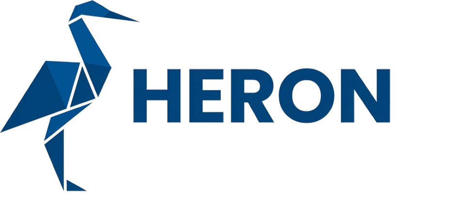

<div align="center">

<picture>
  <source media="(prefers-color-scheme: dark)" srcset="docs/brand/heron-lockup-dark.png">
  
</picture>

### С HERON создавать сайты — просто.

Файловый движок сайтов. Контент в markdown, тема на Jinja2 — на выходе статический сайт или готовый образ nginx.

[](https://github.com/FMSTM/HERON/actions/workflows/ci.yml)
[](https://github.com/FMSTM/HERON/pkgs/container/heron)
[](https://www.python.org/)

Русский · English (скоро)

</div>

---

> **Статус: в разработке.** Каркас, контракты и конвейер сборки образов на месте — сама сборка сайта ещё не работает. Команды отвечают номером задачи, которая их реализует.

## Что это

Сайт — это папка: контент, картинки, тема, один конфиг. HERON читает её и отдаёт готовый HTML. Ни базы, ни админки, ни PHP — в продакшене работает только nginx, отдающий файлы.

- **Markdown — склад контента, тема — раскладка.** Порядок секций в файле не влияет на порядок блоков на странице. Связь между ними по идентификаторам.
- **Путь файла определяет URL.** Новая страница — это один новый файл. Она сама появляется в меню, каталоге, sitemap, hreflang и `llms.txt`.
- **SEO из коробки, а не отдельной задачей.** sitemap, канониклы, hreflang, JSON-LD, `llms.txt` и карта редиректов генерируются из того же фронтматтера, которым написана страница.
- **Движок не живёт в репозитории сайта.** Он приходит образом и прибивается версией в `site.yaml` — один движок на любое число сайтов, без копий и расхождений.

## Быстрый старт

```bash
# папки ещё нет
docker run --rm -v "$PWD:/out" ghcr.io/fmstm/heron:dev new мой-сайт

# папка с контентом уже есть
docker run --rm -v "$PWD:/site" ghcr.io/fmstm/heron:dev init
```

Дальше правите `content/`, `theme/` и `site.yaml` и собираете:

```bash
heron check          # что не так с контентом и конфигом
heron serve          # локальный просмотр с пересборкой
heron build          # → dist/, папка на любой хостинг
heron build --image мой-сайт:1.0   # → образ nginx с сайтом внутри
```

## Безопасный запуск

Сборщику статики не нужно ничего — ни сети, ни прав, ни секретов. Так его и запускаем:

```bash
docker run --rm \
  --network=none \
  --read-only --tmpfs /tmp \
  --cap-drop=ALL --security-opt=no-new-privileges \
  --user "$(id -u):$(id -g)" \
  -v "$PWD:/site" \
  ghcr.io/fmstm/heron:dev build --strict
```

Сборка идёт без сети: всё, что нужно сайту, лежит в папке сайта. Docker-сокет внутрь контейнера не пробрасывается никогда — `build --image` выполняется на хосте.

## Образы

Публикуются в [GitHub Container Registry](https://github.com/FMSTM/HERON/pkgs/container/heron):

| Тег | Что это |
|---|---|
| `ghcr.io/fmstm/heron:dev` | текущая разработка |
| `ghcr.io/fmstm/heron:stage` | обкатка |
| `ghcr.io/fmstm/heron:prod` | то, на чём стоят сайты |
| `ghcr.io/fmstm/heron:0.1.0` | конкретный релиз |

Сайт указывает требуемую версию первой строкой `site.yaml`:

```yaml
heron: ">=0.1,<0.2"
```

Движок сверяет себя с этим требованием до всего остального и отказывается собирать сайт, версию которого не поддерживает.

## Документация

Готовится. Спецификации движка — контракт данных, конвейер сборки, развёртывание сайта, поставка — переезжают в этот репозиторий отдельным заходом.

## Разработка

```bash
git clone git@github.com:FMSTM/HERON.git && cd HERON
uv sync --group dev
uv run pytest
uv run heron --version
```

Ветки: `dev` — основная разработка, каждая фича своей веткой. `stage` — обкатка. `prod` — то, что работает; релиз режется тегом `vX.Y.Z`.

**Граница ядра:** движок не знает ни про один конкретный сайт — ни имён, ни доменов, ни телефонов. Проверяется хуком `scripts/check-boundaries.sh` на каждый коммит и в CI по всем файлам репозитория.

```bash
pre-commit install
```
