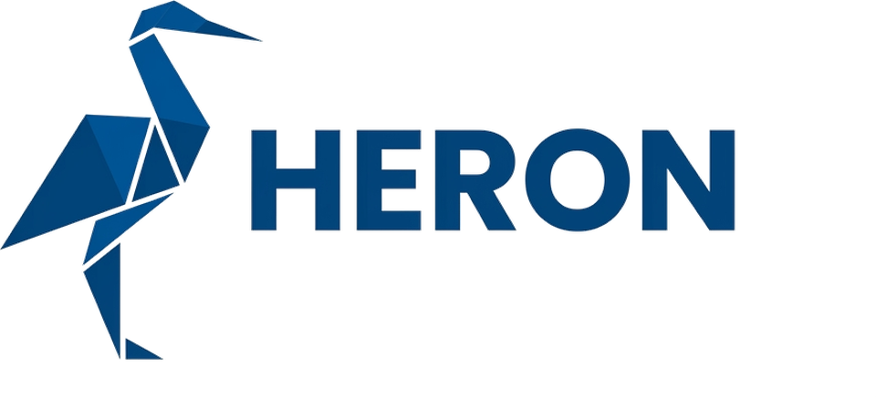

<div align="center">

<picture>
  <source media="(prefers-color-scheme: dark)" srcset="docs/brand/heron-lockup-dark.png">
  
</picture>

### С HERON создавать сайты — просто.

Сайт — это папка с markdown. HERON превращает её в готовый статический сайт или в образ nginx.

[](https://github.com/FMSTM/HERON/actions/workflows/ci.yml)
[](https://github.com/FMSTM/HERON/pkgs/container/heron)
[](https://www.python.org/)

</div>

---

## Что такое HERON

HERON — движок статических сайтов, который приходит одним образом `ghcr.io/fmstm/heron`. Образ умеет две вещи:

1. **создать сайт** — разложить папку с конфигом, темой и стартовыми страницами;
2. **собрать сайт** — прочитать папку и выдать HTML, карту сайта, разметку, редиректы и конфиг nginx.

Сайт при этом — обычная папка: тексты в markdown, картинки, тема на Jinja2 и один конфиг `site.yaml`. Ни базы, ни админки, ни PHP. Как устроена папка, что движок с ней делает и что от неё требует, записано в **контракте** — [`docs/spec/20-data-contract.md`](docs/spec/20-data-contract.md).

```
     папка сайта                         HERON                          результат
 ┌──────────────────┐          ┌───────────────────────┐        ┌─────────────────────┐
 │ site.yaml        │          │ проверка контракта    │        │ dist/  — статика     │
 │ content/<язык>/  │  ──────▶ │ разбор markdown       │ ─────▶ │   на любой хостинг   │
 │ media/  data/    │          │ ссылки, языки, SEO    │        │ или образ nginx      │
 │ theme/           │          │ рендер темы           │        │   с сайтом внутри    │
 └──────────────────┘          └───────────────────────┘        └─────────────────────┘
```

## Как работаешь с сайтом

**Страница — это файл.** `content/uk/about.md` становится `/about/`, `content/ru/about.md` — `/ru/about/`. Путь файла задаёт адрес, папка — раздел.

**В начале каждого файла — SEO-блок.** Восемь групп с комментариями: основное, ключевые запросы, Open Graph, Twitter, разметка, карточка, служебное, связи. Стартовые страницы приходят с ним заполненным, и новая страница делается так: скопировать готовый файл (или `heron page`), поменять `title`, `h1`, `description` и текст. Всё — страница в меню, каталоге, sitemap, hreflang и `llms.txt`.

**Дальше — секции.** `## Заголовок {#якорь}` — блок, который тема ставит на своё место. Список, шаги, вопросы-ответы, таблица — обычный markdown, движок сам понимает форму и отдаёт теме данные.

Подробнее: [понятия](docs/guide/01-concepts.md) · [первый сайт](docs/guide/02-first-site.md) · [страницы и контент](docs/guide/03-content.md).

## Что HERON делает сам, а что — ты

| Сам, без единой строки | Руками — один раз или по мере работы |
|---|---|
| адреса из путей файлов, языковые префиксы | `site.yaml`: домен, языки, название, меню, счётчики |
| меню, каталоги разделов, хлебные крошки | тексты страниц и SEO-блок каждой страницы |
| `sitemap.xml`, `robots.txt`, канонические адреса | тема: шаблоны типов страниц, модули, стили |
| hreflang и переключатель языков | картинки — в `media/`, движок нарежет их сам |
| JSON-LD: страница, крошки, FAQ, сквозной узел сайта | данные для разметки: блок `schema` в `site.yaml` |
| `llms.txt` и полные тексты для нейросетей | сведения о сайте для них — `seo.llms_note` |
| варианты картинок, WebP/AVIF, `srcset`, размеры | `alt` у картинок |
| 301 со старых адресов, 410 для удалённых | старые адреса — `redirect_from`, удалённые — `gone` |
| страница 404 на каждом языке, конфиг nginx | текст 404 — `content/<язык>/404.md` |
| закрытая от индексации дев-сборка | `--env prod` для боевой |
| проверка всего этого с внятными ошибками | исправить то, на что указал отчёт |

Что умеет движок целиком, по темам: [`docs/agents/capabilities.md`](docs/agents/capabilities.md).

## Быстрый старт: один сайт, один движок

Обычный случай — один сайт и стабильный образ `:prod`. Нужен только докер.

```bash
H="docker run --rm -v $PWD:/site -w /site --user $(id -u):$(id -g) ghcr.io/fmstm/heron:prod"

$H new мой-сайт --notes ru        # папка сайта; комментарии и пояснения — по-русски (по умолчанию en)
```

Откройте `мой-сайт/site.yaml`, впишите домен, название, языки (`languages: [uk, ru]`) и меню. Затем:

```bash
$H init мой-сайт                  # папки и стартовые страницы под языки из site.yaml
$H build мой-сайт                 # → мой-сайт/dist/
```

Посмотреть результат:

```bash
docker run --rm -p 8080:8080 -v "$PWD/мой-сайт/dist:/usr/share/nginx/html:ro" \
  nginxinc/nginx-unprivileged:1.27-alpine
```

Дальше — писать страницы и собирать снова. Дев-сборка закрыта от поисковиков и не вставляет счётчики; боевая — `$H build мой-сайт --env prod --strict`.

Пошагово, с разбором каждого шага: [`docs/guide/02-first-site.md`](docs/guide/02-first-site.md). Без докера — `pip install git+https://github.com/FMSTM/HERON.git@prod`, дальше те же команды через `heron`.

## Несколько сайтов и версии движка

Когда сайтов больше одного или их нужно возить образами, удобнее работать из клона этого репозитория: `scripts/site.sh` держит настройки каждого сайта в своём файле и делает всё одной командой.

```bash
git clone https://github.com/FMSTM/HERON.git && cd HERON
./scripts/site.sh мойсайт new ~/sites/мой-сайт   # создать сайт и его окружения dev и prod
./scripts/site.sh мойсайт build dev              # собрать в out/мойсайт-dev
./scripts/site.sh мойсайт serve dev              # посмотреть на localhost:8080
./scripts/site.sh мойсайт image prod             # упаковать в образ nginx
./scripts/site.sh мойсайт smoke prod             # поднять образ и проверить ответы: 200, 404, 301, 410
./scripts/site.sh мойсайт push prod              # отправить образ в реестр
```

Чем отличается от одного сайта:

| | Один сайт | Несколько сайтов |
|---|---|---|
| Чем запускать | `docker run … heron:prod` или `heron` из pip | `scripts/site.sh` из клона репозитория |
| Где настройки сборки | флаги команды | `env/.env.<сайт>.<окружение>`: путь к контенту, окружение, движок, образ, реестр |
| Куда собирается | `dist/` внутри папки сайта | `out/<сайт>-<окружение>`, папка сайта не трогается |
| Какой движок | тот, что запустили | `ENGINE` в env: точная версия, `:prod` или исходники рядом |
| Образ сайта | собрать руками | `site.sh image`, проверка — `site.sh smoke` |

**Версия движка закреплена в самом сайте**: первая строка `site.yaml` — `heron: ">=0.1,<0.2"`. Движок, который не подходит, откажется собирать (`E012`). Так два сайта могут жить на разных версиях, а обновление движка — это смена одной строки.

**Какие образы есть.** Сайты собирают тегом `:prod` или точной версией `:X.Y.Z`. `:beta` и `:dev` — ветки разработки самого движка; дев-сборка сайта — это флаг `--env`, а не другой образ.

Подробно: [`docs/guide/06-deploy.md`](docs/guide/06-deploy.md).

## Документация

**Путь новичка — по порядку:**

| | |
|---|---|
| [01 · Понятия](docs/guide/01-concepts.md) | сайт = папка, ключ и адрес, тип, секция, тема, движок отдельно |
| [02 · Первый сайт](docs/guide/02-first-site.md) | от пустой папки до образа |
| [03 · Страницы и контент](docs/guide/03-content.md) | SEO-блок, секции, ссылки, картинки, разделы, языки |
| [04 · Тема и дизайн](docs/guide/04-theme.md) | `theme.yaml`, шаблоны, модули, что видит шаблон |
| [05 · SEO](docs/guide/05-seo.md) | что генерируется само, что заполнять, переезд со старого сайта |
| [06 · Сборка и выкладка](docs/guide/06-deploy.md) | папка или образ, несколько сайтов, версии движка |

**Справочник — контракт и устройство:**

| | |
|---|---|
| [20 · Контракт данных](docs/spec/20-data-contract.md) | папка сайта, URL, языки, markdown, все поля и ключи, `theme.yaml`, картинки |
| [21 · Движок](docs/spec/21-engine.md) | конвейер сборки, модель страницы, генераторы, команды, коды ошибок |
| [22 · Развёртывание](docs/spec/22-deploy.md) | nginx, CI сайта, переезд |
| [23 · Поставка](docs/spec/23-distribution.md) | образ, команды, образ сайта, темы и плагины, безопасность |
| [Архитектура](docs/architecture.md) | что из чего состоит, одной страницей |

**Для агентов:** [`AGENTS.md`](AGENTS.md) — инструкция по ролям: архитектор, контент и SEO, дизайнер, сборщик.

## Разработка движка

```bash
git clone git@github.com:FMSTM/HERON.git && cd HERON
uv sync --group dev
./scripts/check.sh          # граница ядра, формат, линтер, тесты — то же, что в CI
```

Ветки: `dev` — разработка, каждая фича своей веткой; `beta` — обкатка на живых сайтах; `prod` — то, на чём стоят сайты. Релиз — тег `vX.Y.Z`.

**Граница ядра:** движок не знает ни про один конкретный сайт — ни имён, ни доменов, ни разделов. Проверяет `scripts/check-boundaries.sh` на каждом коммите и в CI.

## Статус и лицензия

Версия 0.1. До 1.0 контракт `site.yaml` и `theme.yaml` может меняться в минорных версиях; сайт закрепляет диапазон версий в `site.yaml` и переезжает осознанно.

Лицензия пока не выбрана: до её появления все права защищены.
